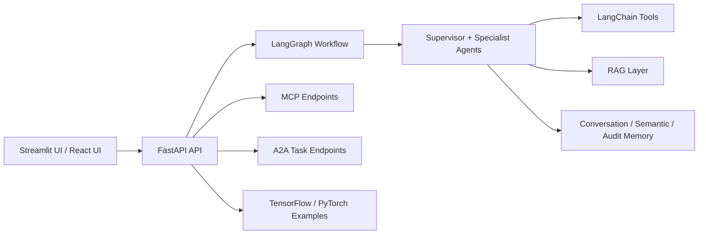

# Architecture Diagram

```mermaid
flowchart LR
    UI[Streamlit UI / React UI] --> API[FastAPI API]
    API --> LG[LangGraph Workflow]
    LG --> AG[Supervisor + Specialist Agents]
    AG --> TOOLS[LangChain Tools]
    AG --> RAG[RAG Layer]
    AG --> MEM[Conversation / Semantic / Audit Memory]
    API --> MCP[MCP Endpoints]
    API --> A2A[A2A Task Endpoints]
    API --> ML[TensorFlow / PyTorch Examples]
```
