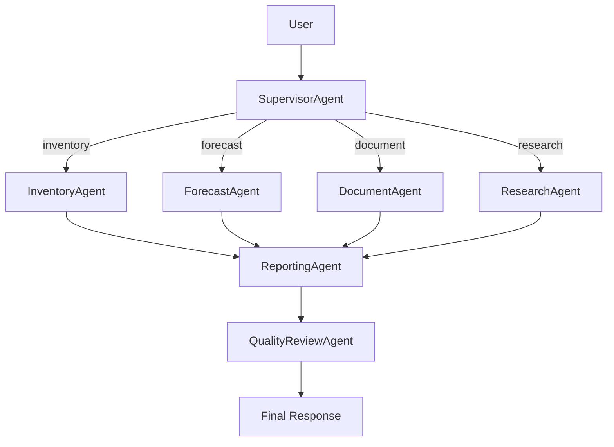

# Workflow Diagram

```mermaid
flowchart TD
    U[User] --> S[SupervisorAgent]
    S -->|inventory| I[InventoryAgent]
    S -->|forecast| F[ForecastAgent]
    S -->|document| D[DocumentAgent]
    S -->|research| R[ResearchAgent]
    I --> P[ReportingAgent]
    F --> P
    D --> P
    R --> P
    P --> Q[QualityReviewAgent]
    Q --> FR[Final Response]
```
